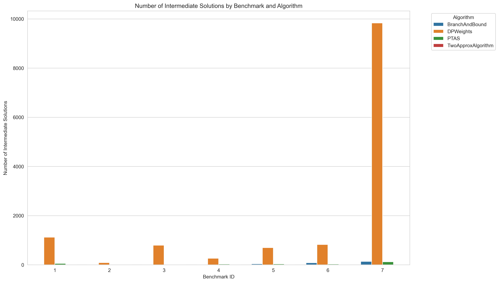
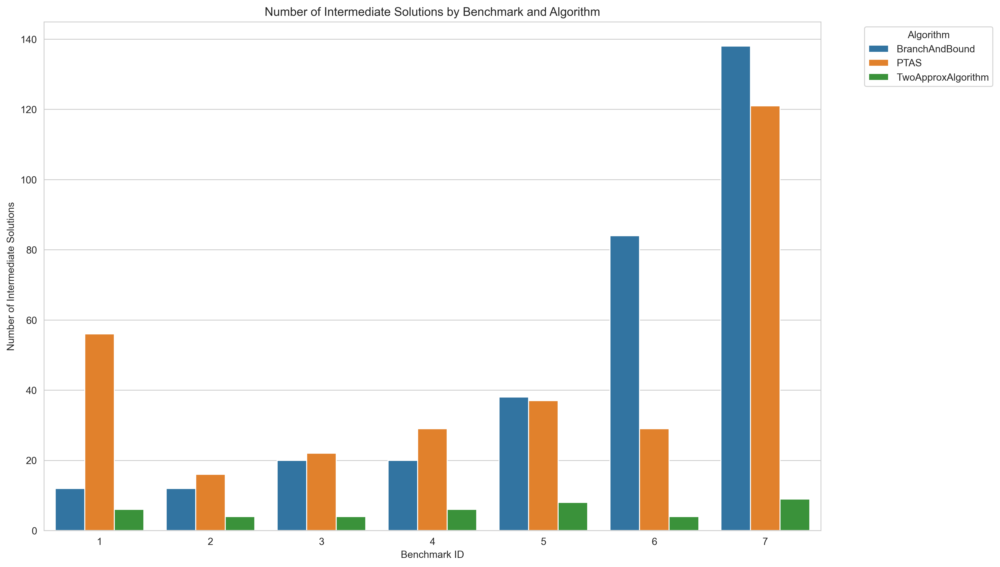
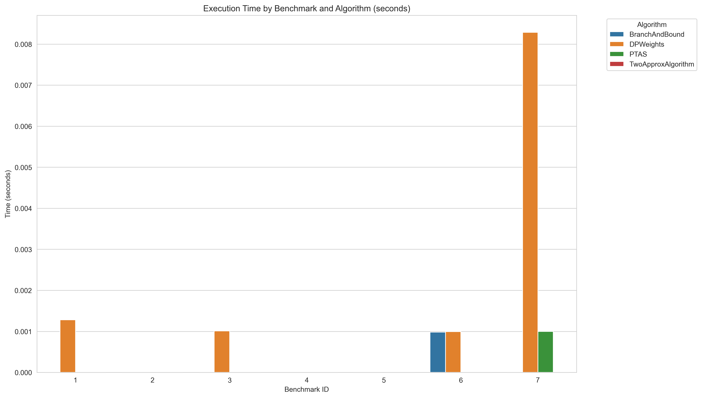
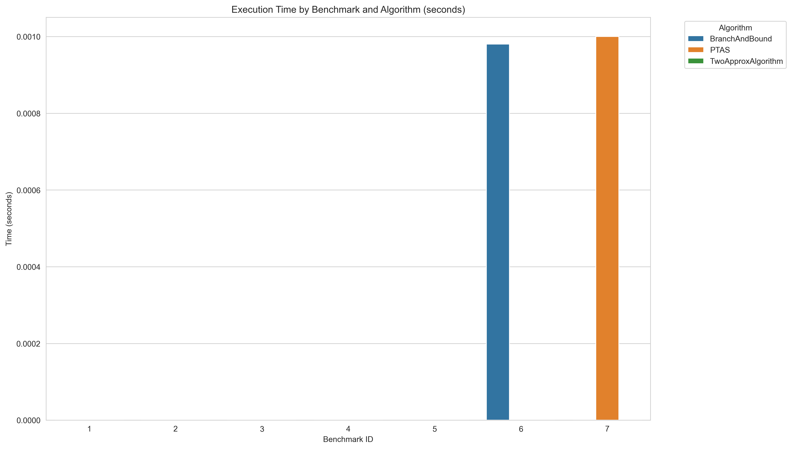
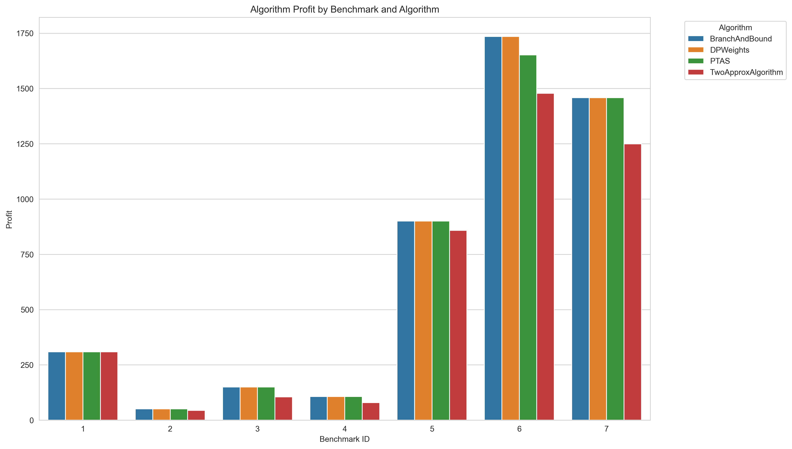

# IO-Lab2-knapsack

Algorithms for solving Knapsack 0-1 problem

# **Отчет:**

Мы реализовали 4 разных алгоритма для поиска подстроки в тексте:

- 2-approx 

- ДП на весах

- Метод ветвей и границ используя задачу LP

- PTAS

Алгоритм на каждом бенчмарке запускался 1000 раз, чтобы оценить среднее время и количество операций для работы алгоритма. Видно, что все алгоритмы (кроме 2-approx) работают верно и возвращают одинаковый результат на одних и тех же бенчмарках. 2-approx алгоритм не обещает лучшего результата, но дает быстрое и близкое к идеальному решение. Ниже представлена таблица результатов, сгруппирована по бенчмаркам и алгоритмам.


# **Таблица:**

Итоговая таблица лежит в файле report.csv (просто результат) и report_diff.csv (результат и сравнение с идеальным ответом)

|   bench id | algorithm          |        time |   number of inter solutions | alg weights                                   |   alg total weight |   alg profit |
|-----------:|:-------------------|------------:|----------------------------:|:----------------------------------------------|-------------------:|-------------:|
|          1 | BranchAndBound     | 2.6548e-05  |                          12 | [1, 1, 1, 1, 0, 1, 0, 0, 0, 0]                |                165 |          309 |
|          1 | DPWeights          | 0.00162329  |                        1123 | [1, 1, 1, 1, 0, 1, 0, 0, 0, 0]                |                165 |          309 |
|          1 | PTAS               | 0.000148377 |                          56 | [1, 1, 1, 1, 0, 1, 0, 0, 0, 0]                |                165 |          309 |
|          1 | TwoApproxAlgorithm | 1.6129e-05  |                           6 | [1, 1, 1, 1, 0, 1, 0, 0, 0, 0]                |                165 |          309 |
|          2 | BranchAndBound     | 1.7504e-05  |                          12 | [0, 1, 1, 1, 0]                               |                 26 |           51 |
|          2 | DPWeights          | 0.000137045 |                          88 | [0, 1, 1, 1, 0]                               |                 26 |           51 |
|          2 | PTAS               | 3.7885e-05  |                          16 | [0, 1, 1, 1, 0]                               |                 26 |           51 |
|          2 | TwoApproxAlgorithm | 8.174e-06   |                           4 | [0, 1, 0, 1, 1]                               |                 24 |           44 |
|          3 | BranchAndBound     | 2.7489e-05  |                          20 | [1, 1, 0, 0, 1, 0]                            |                190 |          150 |
|          3 | DPWeights          | 0.00112794  |                         795 | [1, 1, 0, 0, 1, 0]                            |                190 |          150 |
|          3 | PTAS               | 5.2601e-05  |                          22 | [1, 1, 0, 0, 1, 0]                            |                190 |          150 |
|          3 | TwoApproxAlgorithm | 9.779e-06   |                           4 | [1, 1, 0, 0, 0, 1]                            |                132 |          105 |
|          4 | BranchAndBound     | 2.6421e-05  |                          20 | [1, 0, 0, 1, 0, 0, 0]                         |                 50 |          107 |
|          4 | DPWeights          | 0.000366505 |                         264 | [1, 0, 0, 1, 0, 0, 0]                         |                 50 |          107 |
|          4 | PTAS               | 7.2872e-05  |                          29 | [1, 0, 0, 1, 0, 0, 0]                         |                 50 |          107 |
|          4 | TwoApproxAlgorithm | 1.1101e-05  |                           6 | [0, 1, 0, 1, 1, 1, 1]                         |                 42 |           79 |
|          5 | BranchAndBound     | 5.3593e-05  |                          38 | [1, 0, 1, 1, 1, 0, 1, 1]                      |                104 |          900 |
|          5 | DPWeights          | 0.000903067 |                         698 | [1, 0, 1, 1, 1, 0, 1, 1]                      |                104 |          900 |
|          5 | PTAS               | 0.000110335 |                          37 | [1, 0, 1, 1, 1, 0, 1, 1]                      |                104 |          900 |
|          5 | TwoApproxAlgorithm | 1.3537e-05  |                           8 | [1, 1, 0, 1, 1, 1, 1, 1]                      |                 97 |          858 |
|          6 | BranchAndBound     | 8.9965e-05  |                          84 | [0, 1, 0, 1, 0, 0, 1]                         |                169 |         1735 |
|          6 | DPWeights          | 0.00131625  |                         826 | [0, 1, 0, 1, 0, 0, 1]                         |                169 |         1735 |
|          6 | PTAS               | 7.2641e-05  |                          29 | [1, 0, 0, 1, 0, 0, 1]                         |                160 |         1652 |
|          6 | TwoApproxAlgorithm | 1.1208e-05  |                           4 | [1, 1, 1, 0, 0, 0, 0]                         |                140 |         1478 |
|          7 | BranchAndBound     | 0.000172405 |                         138 | [1, 0, 1, 0, 1, 0, 1, 1, 1, 0, 0, 0, 0, 1, 1] |                749 |         1458 |
|          7 | DPWeights          | 0.013012    |                        9832 | [1, 0, 1, 0, 1, 0, 1, 1, 1, 0, 0, 0, 0, 1, 1] |                749 |         1458 |
|          7 | PTAS               | 0.00044489  |                         121 | [1, 0, 1, 0, 1, 0, 1, 1, 1, 0, 0, 0, 0, 1, 1] |                749 |         1458 |
|          7 | TwoApproxAlgorithm | 2.808e-05   |                           9 | [1, 1, 1, 1, 1, 1, 1, 1, 0, 0, 0, 0, 0, 0, 0] |                653 |         1249 |

# **Количество операций:**



Более детально без DP:


# **Время работы:**



Более детально без DP:


# **Итоговые результаты:**



Видно, что ДП на весах больше всех требует времени и промежуточных решений, но всегда выдает точный результат. PTAS и Метод ветвей и границ затрачивают примерно одинаковое количество времени и ресурсов для поиска решения, при этом Метод ветвей и границ всегда точно решает задачу. 2-approx может выдавать неточный ответ, но всегда относительно близко к хорошему, при этом работает быстрее других алгоритмов и требует меньше промежуточных решений.

# **Запуск:**

## 1. Клонировать репозиторий

```bash
git clone https://github.com/dragonpuffle/IO-Lab2-knapsack.git
cd IO-Lab2-knapsack
```

## 2. Установить зависимости 

```bash
pip install -r requirements.txt
```


## 3. Запустить с бенчмарками

```python
python -m src.benchmarks
```

## 4. Обновить графики

```python
 python main.py   
```
